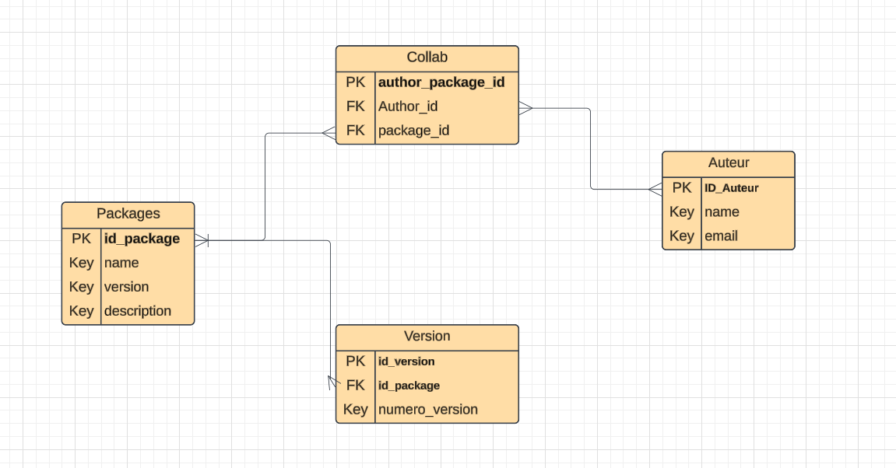

# eljassimi_abdelmouhaimine_js_packages
# Gestion des Packages JavaScript

Une application web conçue pour moderniser et centraliser la gestion des packages JavaScript et de leurs auteurs. Ce projet vise à simplifier la gestion des versions.

## Table des Matières

1. [Contexte](#contexte)
2. [Schéma de la Base de Données](#schéma-de-la-base-de-données)
3. [Diagramme UML - Cas d'Utilisation](#diagramme-uml---cas-dutilisation)
4. [Installation et Configuration](#installation-et-configuration)
5. [Scripts SQL](#scripts-sql)
6. [Fonctionnalités en PHP](#fonctionnalités-en-php)
7. [Contribution](#contribution)

---

## Contexte

Actuellement, les informations sur les packages et leurs auteurs sont dispersées, ce qui complique leur gestion. Ce projet propose une application web pour :
- **Gérer les packages** : ajout, mise à jour, suppression et gestion des versions.
- **Gérer les auteurs** : ajout, modification, suppression et association aux packages.
- **Rechercher facilement** : recherche de packages par auteur ou par mot-clé.

---

## Schéma de la Base de Données

### Entités et Relations

1. **Packages**
   - **Attributs** : `id_package` (clé primaire), `name`, `version`, `description`.
   - **Relation** : un package peut avoir plusieurs versions.

2. **Versions**
   - **Attributs** : `id_version` (clé primaire), `id_package` (clé étrangère), `numero_version`.
   - **Relation** : une version est associée à un package (relation plusieurs-à-un).

3. **Auteurs**
   - **Attributs** : `ID_Auteur` (clé primaire), `name`, `email`.
   - **Relation** : un auteur peut collaborer à plusieurs packages via la table **Collab**.

4. **Collab** (table de liaison)
   - **Attributs** : `author_package_id` (clé primaire), `Author_id` (clé étrangère vers **Auteurs**), `package_id` (clé étrangère vers **Packages**).
   - **Relation** : établit une relation plusieurs-à-plusieurs entre les auteurs et les packages.

### Diagramme ERD



---

## Diagramme UML - Cas d'Utilisation

Le diagramme UML représente les interactions entre les acteurs et le système. [Voir le diagramme complet](assets/UseCaseDiagram1.jpg).

### Acteurs Principaux
- **Utilisateur** : peut visualiser des packages et leurs auteurs.
- **Administrateur** : gère les packages, auteurs et versions (ajout, modification, suppression).

---

## Installation et Configuration

### Pré-requis
- **Serveur Web** : Apache.
- **PHP** : Version 7.4 ou supérieure.
- **MySQL** : Pour la base de données.
- **Éditeur de Code** : Visual Studio Code ou autre.

### Étapes d'Installation
1. Clonez le dépôt GitHub :
   ```bash
   git clone https://github.com/Youcode-Classe-E-2024-2025/eljassimi_abdelmouhaimine_js_packages.git

## Set Up the Database

1. **Create the Database**
   - Open phpMyAdmin or your MySQL client terminal.
   - Execute the SQL script located in `/sql/database.sql`.
   - This script will create the database and the necessary tables with fake data.

2. **Configure the Database Connection**
   - Navigate to `includes/connect.php`.
   - Update the connection details as follows:
     ```php
     $host = 'localhost';
     $port = '';  // No port required for XAMPP
     $dbname = 'javascriptpackages';  // Database name
     $user = 'root';  // Your database user
     $password = '';  // No password required for XAMPP
     ```
